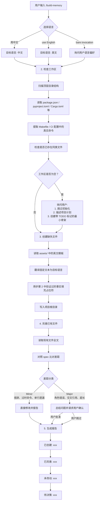
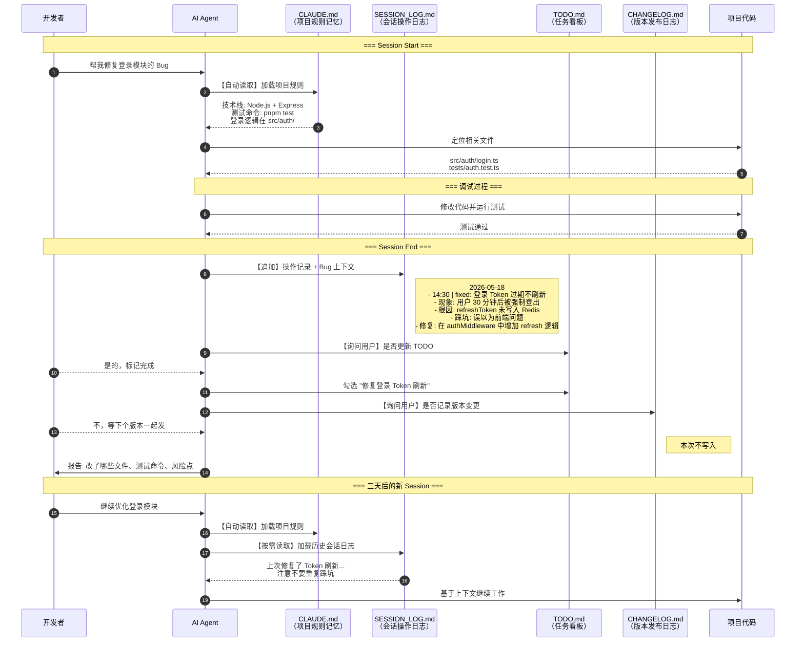
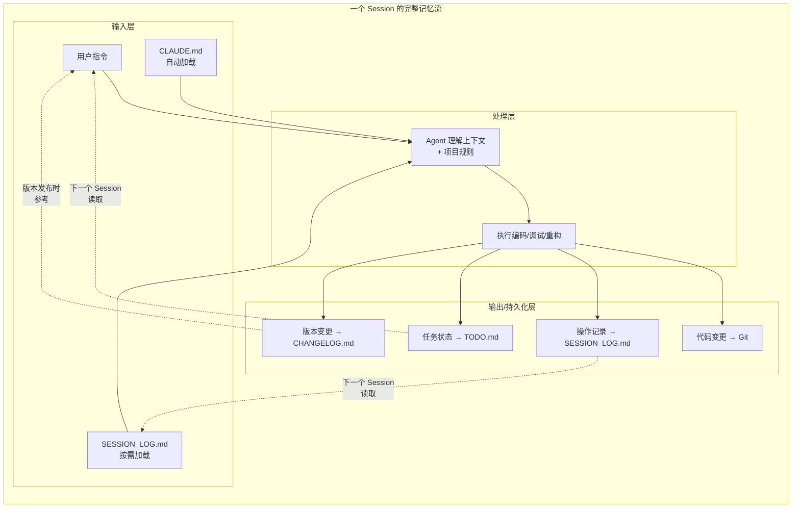

# build-memory — 建立跨 Agent 的项目记忆层

> **保存上下文，外化记忆，让 Agent 之间、人与 Agent 之间相互对齐。**

> 本项目 fork 自原 `workspace-init` 项目，并在 `build-memory` 名称下延续其工作区上下文初始化思路。

---

## 一、为什么要有项目记忆层？

当使用多个 Agent 在一个跨越数周甚至数月的项目中工作时，如果没有项目记忆层可能会遇到这些问题：

- **每开一个新会话、需要加一个新功能，Agent 都需要重新读技术栈、命名习惯、关键目录结构。**
- **每个会话之间相互隔离**，Agent 不知道上一次会话做了什么。
- **Agent 虽然都有各自的记忆，但是却相互隔离**，没有共享历史，各自为战，一个学到的东西另一个不知道，一个干过的事情另一个却不知道。
- **工作历史散落在会话里**，做过的决策、遇到的问题、踩过的坑、探索过又放弃的路径——随着会话被关闭，全部丢失，再去找就如大海捞针。
- **每天的工作可能有数十个 session**，一天的工作结束有可能会忘记最开始做了哪些工作；周一继续工作，如果没有记录，很可能不知道上周还有什么遗留事项。

这些不是文件管理问题，而是**记忆问题**。

`build-memory` 通过建立一套轻量、职责分明的文件外化上下文，建立持久的记忆层，每个 Agent 都基于同样的共享上下文工作。

---

## 二、build-memory 做了什么？

### 五个关键文件

Skill 会检查你的工作区并创建或完善五个文件：

| 文件 | 在共享记忆中的角色 | 面向受众 |
|------|------------------|----------|
| `AGENTS.md` | **通用项目事实与规则库**——包含技术栈、目录结构、开发命令、测试规则及所有重要约定（Single Source of Truth） | 所有 Code Agents |
| `CLAUDE.md` | **Claude 专属入口（Stub）**——仅包含对 `AGENTS.md` 的引用及极少数针对 Claude 机制的补充行为约束 | Claude Code |
| `CHANGELOG.md` | **发布历史**——版本粒度的、用户可见的变更历史 | 开发者、用户 |
| `SESSION_LOG.md` | **协作日记**——做过的决策、遇到的问题和调试上下文 | 开发者、Agent |
| `TODO.md` | **用户主导的待办清单**——开发进度、待办及已完成事项 | 开发者、Agent |

每个文件有清晰、独立的职责。这避免了常见的失败模式：一个文件堆积所有内容，直到变得不可读。

同时会安装一个轻量 `.memory/` 支撑目录：

- `.memory/session_log.py`：`SESSION_LOG.md` 的推荐写入脚本，包含锁重试、7 天归档和结构化字段。
- `.memory/KNOWLEDGE.md`：长期可复用经验和稳定决策，仅按需读取。
- `.memory/sessions/`：超过最近窗口的每日归档日志。

### 原则

#### 先检查，再写入

Skill 从不虚构内容。它首先检查你的项目：

- 顶层目录结构
- 构建清单（`package.json`、`pyproject.toml`、`Cargo.toml` 等）
- `Makefile` 或 CI 配置中声明的真实命令
- 是否已存在同类文件（如 `agent.md`、`WORKLOG.md`）

**命令和路径从不编造。** 当某个事实无法从仓库中确认时，Skill 会留下 `TODO: 待确认` 标记，并告诉你需要填写什么。

#### 不静默重写

当文件已存在时，Skill 会将其与规范对比：

- **小问题**（措辞、过时命令、单行遗漏）→ 直接修改并报告
- **大问题**（文件角色错误、文件间交叉引用、长度超过建议限制的两倍）→ **任何修改都需要用户明确批准**

#### 主从引用 (Master-Mirror)

在本项目生成的模板中，`CLAUDE.md` 仅作为一个极简的入口桩文件，通过 `@AGENTS.md` 单向引入 `AGENTS.md` 中的所有项目规则。所有涉及具体技术栈、命令和路径的内容必须集中在 `AGENTS.md` 中维护，从而彻底消除两份文件间可能出现的信息漂移（Drift）。

### 记忆层的工作方式

**按需加载，渐进式披露。** 启动会话时记忆不会全部加载到上下文中，而是 Agent 根据需求和用户意图，主动去读取。

实现方式是在 `AGENTS.md` & `CLAUDE.md` 中规定：

```markdown
## 跟踪文件

- `SESSION_LOG.md`：最近 7 天协作日志。使用 `python .memory/session_log.py` 追加记录；不要手工编辑。
- `.memory/KNOWLEDGE.md`：长期可复用经验和决策；仅在任务明显依赖项目历史时读取。
- `.memory/sessions/`：超过最近窗口的每日归档日志；默认不读取。
- `TODO.md`：用户主导的任务看板，记录项目重要待办事项；按需读取，若需编辑需征求用户同意。
- `CHANGELOG.md`：面向发布的变更日志；发布版本相关变更或记录里程碑时更新。
```

---

## 三、记忆层解决了什么样的痛点？

### 降低 Session 启动成本

把稳定的背景知识写入 `AGENTS.md` & `CLAUDE.md`，变成项目规范，Agent 再开始会话时会自动加载，降低 Agent 的理解成本，不用从头开始去理解整个项目。

### 降低跨 Agent 的对齐成本

`AGENTS.md` & `CLAUDE.md` 是共享的规范，实现 Agents 之间的目标对齐；`SESSION_LOG.md` 记录每个 Agent 在每个会话里面做了什么工作，实现工作留痕，相当于将每个 Agent 的记忆外化到一个固定的文件中，保证工作过程中的信息互通。

### 项目知识的沉淀

`SESSION_LOG.md` 和 `CHANGELOG.md` 不是为了替代 git history，而是为了补充"为什么"的记录——某个设计决策的上下文、某次调试的曲折过程，也便于项目复盘，沉淀经验和踩坑。这些是 git log 里不会写的东西。**三个月后再回来维护代码，你会庆幸它还在。**

### 实现人和 Agent 之间的对齐

`TODO.md` 是一个简单的任务看板，人和 Agent 共同维护，由人来决定记录哪些重要的待办事项，Agent 通过阅读 `TODO.md` 与你的目标对齐，防止跑偏。

### 写日报/周报

让 Agent 去读 `SESSION_LOG.md`，总结关于该项目的进度。

---

## 四、Skill 工作流程

运行 `/build-memory` 时，skill 内部是如何工作的？



---

## 五、记忆层在一个 Session 中如何发挥作用

以一个具体的开发 Session 为例，看看外部记忆层是如何在"人-Agent-项目"三者之间流转的。

### 场景：修复一个生产环境的 Bug



### 记忆层的工作机制



---

## 六、安装

本 Skill 遵循跨 Agent 的 `SKILL.md` 标准，同一文件夹可在 Claude Code、Codex、Cursor 和 Google Antigravity 中使用。将 `build-memory/` 文件夹放入各工具对应的 skills 目录即可。

### Claude Code

| 范围 | 路径 | 可用范围 |
|------|------|----------|
| 个人（推荐） | `~/.claude/skills/build-memory/` | 所有项目 |
| 项目 | `<repo>/.claude/skills/build-memory/` | 仅当前仓库 |

Windows 上 `~` 解析为 `C:\Users\<用户名>`。

### OpenAI Codex（CLI / IDE）

| 范围 | 路径 | 可用范围 |
|------|------|----------|
| 全局 | `~/.codex/skills/build-memory/` | 所有项目 |
| 项目 | `<repo>/.agents/skills/build-memory/` | 仅当前仓库 |

`CODEX_HOME` 环境变量可覆盖 `~/.codex`。添加后重启 Codex。

### Cursor

| 范围 | 路径 | 可用范围 |
|------|------|----------|
| 项目（推荐） | `<repo>/.cursor/skills/build-memory/` | 仅当前仓库 |

全局 `~/.cursor/skills/` 目录尚未被官方文档确认；项目范围是可靠的选择。添加后重载工作区（`Cmd/Ctrl+Shift+P → Developer: Reload Window`）。

### Google Antigravity

| 范围 | 路径 | 可用范围 |
|------|------|----------|
| 全局 | `~/.gemini/antigravity/skills/build-memory/` | 所有项目 |
| 工作区 | `<workspace-root>/.agent/skills/build-memory/` | 仅当前工作区 |

### 验证安装

复制完成后，目录结构应如下：

```
<install-root>/build-memory/
├── SKILL.md
├── README.md
├── assets/
│   ├── .memory/
│   │   ├── session_log.py
│   │   ├── KNOWLEDGE.md
│   │   └── sessions/
│   ├── AGENTS.md
│   ├── CLAUDE.md
│   ├── SESSION_LOG.md
│   ├── TODO.md
│   └── CHANGELOG.md
└── reference/
```

文件夹必须直接包含 `SKILL.md`——不要多嵌套一层，否则 Agent 无法检测到 Skill。

---

## 七、使用

### 基础调用

在 Claude Code 或 Codex 中运行：

```
/build-memory
```

Skill 会接管后续流程，你只需要回答它的确认问题。

### 首次初始化

典型的首次运行流程：

**步骤 1 — 选择语言**

Skill 会问：文件用什么语言？

- 中文，说"用中文"
- 英文，说"use English"
- 不指定的话，它会询问而不是猜测

**步骤 2 — 检查工作区**

Skill 扫描你的项目：
- 列出顶层目录
- 从 `package.json`、`pyproject.toml` 等识别技术栈
- 收集可用的脚本命令
- 检查是否已存在同类文件

**步骤 3 — 生成文件**

基于检查结果，Skill 创建五个文件中缺失的部分。内容基于真实项目事实；命令不会编造。无法确认的内容标记为 `TODO: 待确认`，供你稍后填写。

例如，你可能会看到：

> `CLAUDE.md` 已创建，但测试命令无法从仓库中确认。请在文件中找到 `TODO: 待确认` 标记，替换为你的实际测试命令。

**步骤 4 — 审阅结果**

Skill 以简洁的报告结束：
- 哪些文件**已创建**
- 哪些文件**已完善**
- 哪些文件**未改动**
- 哪些变更**待你决策**

### 日常维护

当项目发生变化（新的测试框架、新的构建命令）时，重新运行 `/build-memory`：

**Skill 将现有文件与规范对比，对每个差距分类：**

| 变更类型 | 处理方式 | 示例 |
|----------|----------|------|
| 轻微 | 直接修改并报告 | 更新过时命令、添加遗漏的状态标签 |
| 严重 | 先询问，再行动 | 文件角色错误、`AGENTS.md` 引用 `CLAUDE.md`、文件超过长度限制 |

**你可以随时说"跳过"或"保留"**——没有任何建议是被强制的。

### 各文件的日常使用

这些文件不是装饰，它们会成为你正常工作流的一部分。

**`AGENTS.md` + `CLAUDE.md` —— 项目规则**

Claude Code / Codex 会自动读取项目中的 `CLAUDE.md` 和 `AGENTS.md`，与项目约定对齐。

**`SESSION_LOG.md` —— 人类的协作日记**

有意义的 Agent 会话结束后，Skill 可以追加条目：

```markdown
## 2026-05-04
- 决策：放弃 ORM，使用手写 SQL
  - 原因：查询过于复杂；ORM 生成的 SQL 性能差
- 问题：Docker 构建在 Windows 上因路径分隔符失败
  - 修复：将 `COPY` 指令中的反斜杠替换为正斜杠
```

这是 `git log` 不会保留的上下文。三个月后回来维护代码时，你会庆幸它还在。

**`TODO.md` —— 你的任务看板**

`TODO.md` 是一个简单的 Markdown 看板：

```markdown
## 待办
- [ ] 重构用户认证模块
- [ ] 将单元测试覆盖率提升到 80%

## 已完成
- [x] 升级依赖到最新版本
```

你和 Agent 共同维护它，但你掌握方向盘。

**`CHANGELOG.md` —— 面向发布的版本历史**

只记录发布级别的变更，不是每次提交。适合开源项目或任何需要让用户了解变更内容的项目：

```markdown
## v1.2.0 — 2026-05-01
### 新增
- 批量导入支持

### 修复
- 导出时的编码问题
```

### 手动更新

如果你想只更新某一个文件，直接告诉 Agent：

- "用新的 API 约定更新 AGENTS.md。"
- "把我们刚才做的决策追加到 SESSION_LOG。"
- "在 TODO.md 中把那项重构标记为完成。"

Skill 会识别这些请求并路由到对应的流程。

### 与版本控制配合

生成的文件应该被提交：

```bash
git add AGENTS.md CLAUDE.md CHANGELOG.md SESSION_LOG.md TODO.md
git commit -m "chore: init agent workspace tracking files"
```

这样团队共享一套一致的 Agent 规则集，新贡献者也能立即为他们的 Agent 配置好上下文。

---

## 八、什么时候用 / 什么时候不用

### 推荐使用

- 第一次用 Claude Code 启动新项目
- 发现 Agent 反复询问相同的基础问题
- 团队使用多个 AI 助手，需要共享规范
- 项目中积累了杂乱的笔记（`notes.md`、`ai-context.md` 等），需要清理结构
- 想回顾过去的 Agent 协作记录，但聊天记录已经滚动消失

### 不推荐使用

- 你期望一个完全自主、无需确认的 Agent 管家——这个 Skill 在关键决策上需要用户输入
- 你期望这些文件替代代码注释或架构文档——它们是协作辅助工具，不是技术文档
- 项目生命周期极短——初始化本身有成本

---

## 九、存在的问题

- `SESSION_LOG.md` 目前没有文件锁机制，当多个 session 同时编辑时会有冲突

- 随着 `SESSION_LOG.md` 记录的增加，可能会导致上下文的膨胀，目前有两种解决方案：
    - 定期压缩历史会话，只保留关键动作或信息
    - 只保留最近一周的会话历史，一周前的移动到 `HISTORY.md` 中，在 `SESSION_LOG.md` 中用链接指向 `HISTORY.md`，比如在 `SESSION_LOG.md` 末尾写到：YYYY-MM-DD 及以前的会话记录见 `HISTORY.md`

---

## License

MIT
