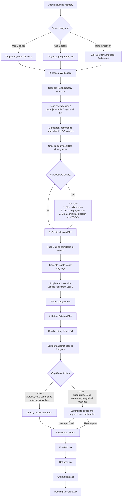
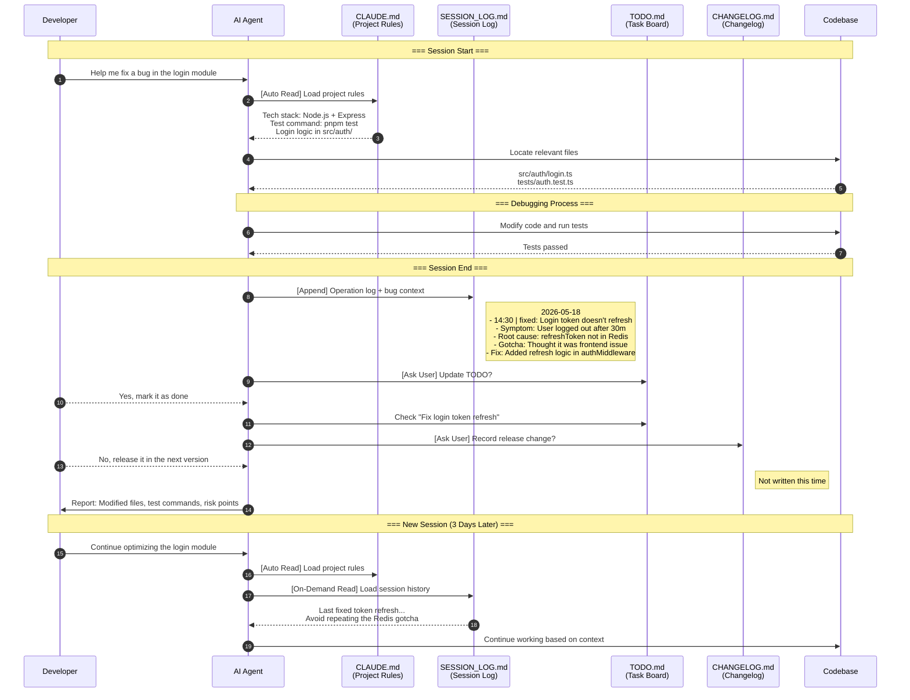
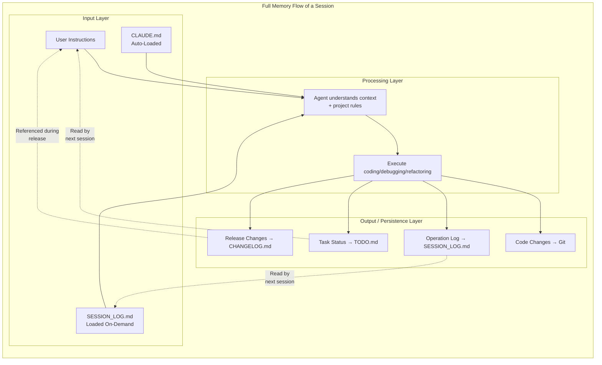

# build-memory — Building a Cross-Agent Project Memory Layer

> **Preserve context, externalize memory, and keep humans and agents aligned.**

> This project is forked from the original `workspace-init` project and continues its workspace context-initialization approach under the `build-memory` name.

---

## 1. Why Have a Project Memory Layer?

When working with multiple agents on a project spanning weeks or even months, you might encounter the following friction points without a project memory layer:

- **Every new session or feature requires re-explaining context:** The agent needs to re-read the tech stack, naming conventions, and key directory structures.
- **Sessions are isolated from one another:** Agents have no idea what was done in the previous session.
- **Agents have isolated memories despite working on the same project:** With no shared history, agents work in silos. What one agent learns or does is completely unknown to another.
- **Work history is scattered across chat sessions:** Design decisions, encountered issues, gotchas, and abandoned exploration paths are completely lost when sessions are closed, making them extremely hard to retrieve later.
- **Dozens of sessions can happen daily:** By the end of the day, you might forget what you started with. On Mondays, without records, it's easy to lose track of leftover items from the previous week.

These are not file-management problems, but **memory problems**.

`build-memory` establishes a lightweight, role-separated, externalized context to build a persistent memory layer, ensuring every agent works on the same shared context.

---

## 2. What Does build-memory Do?

### Five Key Files

The skill inspects your workspace and creates or refines five key files:

| File | Role in Shared Memory | Target Audience |
|------|-----------------------|-----------------|
| `AGENTS.md` | **General Project Facts & Rules** — Single Source of Truth containing tech stack, directory structure, dev commands, and testing rules | All Code Agents |
| `CLAUDE.md` | **Claude-Specific Entry Stub** — A minimalist entry point importing `AGENTS.md` and holding only a few Claude-specific behavioral constraints | Claude Code |
| `CHANGELOG.md` | **Release History** — version-grained, user-visible change history | Developers, Users |
| `SESSION_LOG.md` | **Collaboration Journal** — decisions made, issues encountered, and debugging context | Developers, Agents |
| `TODO.md` | **User-Led Backlog** — development progress, pending, and completed tasks | Developers, Agents |

Each file has a clear, independent responsibility. This prevents a common failure mode: accumulating all context in a single file until it becomes unreadable.

It also installs a lightweight `.memory/` support directory:

- `.memory/session_log.py`: the recommended writer for `SESSION_LOG.md`, with lock retries, 7-day archival, and structured fields.
- `.memory/KNOWLEDGE.md`: long-term reusable lessons and durable decisions, read on demand only.
- `.memory/sessions/`: archived daily session logs older than the recent window.

### Principles

#### Inspect First, Write Second

The skill never invents details. It first inspects your project for:
- Top-level directory structure
- Build manifests (`package.json`, `pyproject.toml`, `Cargo.toml`, etc.)
- Real commands declared in `Makefile` or CI configurations
- Existing similar files (e.g., `agent.md`, `WORKLOG.md`)

**Commands and paths are never fabricated.** When a fact cannot be verified from the repository, the skill leaves a `TODO: confirm` marker and notifies you of what needs to be filled in.

#### No Silent Rewrites

When a file already exists, the skill compares it against the specification:
- **Minor Issues** (wording, stale commands, a missing single line) → Edited directly and reported.
- **Major Issues** (wrong file role, cross-references, length exceeding twice the recommended limit) → **Any modification requires explicit user approval.**

#### Master-Mirror Pattern

In the generated templates, `CLAUDE.md` serves only as a minimalist entry stub that one-way imports all project rules via `@AGENTS.md`. All facts regarding the tech stack, commands, and paths are centrally maintained in `AGENTS.md`. This Single Source of Truth approach completely eliminates information drift between the two files.

### How the Memory Layer Works

**On-demand loading and progressive disclosure.** Memory is not loaded entirely into the context at session startup. Instead, the agent actively reads it based on current needs and user intent.

This is achieved by specifying the following rules in `AGENTS.md` and `CLAUDE.md`:

```markdown
## Tracking Files

- `SESSION_LOG.md`: Recent 7-day collaboration log. Use `python .memory/session_log.py` to append notes; do not edit it manually.
- `.memory/KNOWLEDGE.md`: Long-term reusable lessons and decisions; read only when the task likely depends on project history.
- `.memory/sessions/`: Archived daily logs older than the recent window; do not read by default.
- `TODO.md`: A user-led task board tracking important project items. Read on-demand; edits require user consent.
- `CHANGELOG.md`: Release-oriented change log. Update during release-related changes or milestone tracking.
```

---

## 3. What Pain Points Does the Memory Layer Solve?

### Lowering Session Startup Cost
Writing stable background knowledge into `AGENTS.md` & `CLAUDE.md` as project rules allows agents to automatically load them at session startup. This drastically reduces the cognitive load on agents, eliminating the need to understand the project from scratch every time.

### Lowering Alignment Cost Across Agents
`AGENTS.md` & `CLAUDE.md` serve as a shared specification, keeping agents aligned on goals. `SESSION_LOG.md` records what each agent does in every session, externalizing their memories into a fixed file to ensure information flow during collaboration.

### Preserving Project Knowledge
`SESSION_LOG.md` and `CHANGELOG.md` are not meant to replace git history, but to complement it with the "why" — the context behind design decisions and the winding path of debugging. This aids in retrospectives and keeps hard-won lessons alive. These are the things `git log` won't tell you. **When you return to maintain the code three months later, you'll be glad it's there.**

### Aligning Humans and Agents
`TODO.md` is a simple task board co-maintained by humans and agents. The human decides which important items to record, and the agent reads `TODO.md` to align with your goals and stay on track.

### Generating Status Reports
Easily ask the agent to read `SESSION_LOG.md` to summarize the project's progress for daily or weekly reports.

---

## 4. Skill Workflow

What happens under the hood when you run `/build-memory`?



---

## 5. How the Memory Layer Functions in a Session

Let's take a concrete development session as an example to see how the external memory layer flows among the human, agent, and the project.

### Scenario: Fixing a Production Bug



### Memory Flow Mechanism



---

## 6. Installation

This skill adheres to the cross-agent `SKILL.md` standard. The same folder can be used in Claude Code, Codex, Cursor, and Google Antigravity. Simply place the `build-memory/` folder into the skills directory corresponding to each tool.

### Claude Code

| Scope | Path | Availability |
|------|------|----------|
| Personal (Recommended) | `~/.claude/skills/build-memory/` | All projects |
| Project | `<repo>/.claude/skills/build-memory/` | Current repository only |

On Windows, `~` resolves to `C:\Users\<username>`.

### OpenAI Codex (CLI / IDE)

| Scope | Path | Availability |
|------|------|----------|
| Global | `~/.codex/skills/build-memory/` | All projects |
| Project | `<repo>/.agents/skills/build-memory/` | Current repository only |

The `CODEX_HOME` environment variable can override `~/.codex`. Restart Codex after adding.

### Cursor

| Scope | Path | Availability |
|------|------|----------|
| Project (Recommended) | `<repo>/.cursor/skills/build-memory/` | Current repository only |

The global `~/.cursor/skills/` directory is not officially confirmed by documentation; project scope is a reliable choice. Reload the workspace after adding (`Cmd/Ctrl+Shift+P → Developer: Reload Window`).

### Google Antigravity

| Scope | Path | Availability |
|------|------|----------|
| Global | `~/.gemini/antigravity/skills/build-memory/` | All projects |
| Workspace | `<workspace-root>/.agent/skills/build-memory/` | Current workspace only |

### Verifying Installation

After copying, the directory structure should look like this:

```
<install-root>/build-memory/
├── SKILL.md
├── README.md
├── assets/
│   ├── .memory/
│   │   ├── session_log.py
│   │   ├── KNOWLEDGE.md
│   │   └── sessions/
│   ├── AGENTS.md
│   ├── CLAUDE.md
│   ├── SESSION_LOG.md
│   ├── TODO.md
│   └── CHANGELOG.md
└── reference/
```

The folder must directly contain `SKILL.md` — do not nest it under an extra directory level, or the agent won't detect the skill.

---

## 7. Usage

### Basic Invocation

In Claude Code or Codex, run:

```
/build-memory
```

The skill will take over the process; you only need to answer its confirmation questions.

### First-Time Initialization

A typical first-run workflow:

**Step 1 — Choose Language**

The skill asks: What language should the files use?

- For Chinese, say "用中文"
- For English, say "use English"
- If unspecified, it will ask instead of guessing.

**Step 2 — Inspect Workspace**

The skill inspects your project:
- Lists the top-level directories
- Detects the tech stack from `package.json`, `pyproject.toml`, etc.
- Collects available script commands
- Checks for existing equivalent files

**Step 3 — Generate Files**

Based on inspection results, the skill creates missing files. The content is grounded in real project facts; commands are never invented. Unconfirmed content is marked with `TODO: confirm` for you to fill in later.

For example, you might see:

> `CLAUDE.md` has been created, but the test command could not be confirmed from the repository. Please find the `TODO: confirm` marker in the file and replace it with your actual test command.

**Step 4 — Review Results**

The skill concludes with a concise report:
- Which files were **created**
- Which files were **refined**
- Which files were **left unchanged**
- Which changes are **pending your decision**

### Ongoing Maintenance

When the project changes (e.g., new test frameworks, new build commands), re-run `/build-memory`:

**The skill compares existing files against specifications and classifies each gap:**

| Change Type | Handling | Example |
|-------------|----------|---------|
| Minor | Direct modification & report | Updating stale commands, adding missing status tags |
| Major | Ask first, then act | Wrong file role, `AGENTS.md` referencing `CLAUDE.md`, file exceeding length limits |

**You can always choose to "skip" or "keep"** — no suggestions are forced.

### Daily Use of Each File

These files are not decorative; they become part of your regular workflow.

**`AGENTS.md` + `CLAUDE.md` —— Project Rules**

Claude Code / Codex automatically reads `CLAUDE.md` and `AGENTS.md` to align with project conventions.

**`SESSION_LOG.md` —— Collaboration Journal**

After meaningful agent sessions, the skill can append entries:

```markdown
## 2026-05-04
- Decision: Abandon ORM, use raw SQL
  - Reason: Queries are too complex; ORM-generated SQL has poor performance
- Issue: Docker build fails on Windows due to path separators
  - Fix: Replace backslashes with forward slashes in `COPY` directives
```

This is context `git log` won't preserve. When you return to maintain the code three months later, you'll be glad it's there.

**`TODO.md` —— Your Task Board**

`TODO.md` is a simple Markdown kanban:

```markdown
## Pending
- [ ] Refactor user authentication module
- [ ] Raise unit test coverage to 80%

## Done
- [x] Upgrade dependencies to the latest version
```

You and the agent co-maintain it, but you hold the steering wheel.

**`CHANGELOG.md` —— Release-Facing Version History**

Records release-level changes only, not every single commit. Ideal for open-source projects or any project where users need to understand the updates:

```markdown
## v1.2.0 — 2026-05-01
### Added
- Bulk import support

### Fixed
- Encoding issues during export
```

### Manual Updates

If you want to update only a specific file, tell the agent directly:

- "Update AGENTS.md with the new API conventions."
- "Append the decision we just made to SESSION_LOG."
- "Mark the refactoring task as completed in TODO.md."

The skill will recognize these requests and route them to the corresponding flow.

### Working with Version Control

Generated files should be committed:

```bash
git add AGENTS.md CLAUDE.md CHANGELOG.md SESSION_LOG.md TODO.md
git commit -m "chore: init agent workspace tracking files"
```

This ensures the team shares a consistent set of agent rules, enabling new contributors to set up context for their agents instantly.

---

## 8. When to Use / When Not to Use

### Recommended

- Starting a new project with Claude Code for the first time.
- Noticing that agents repeatedly ask identical baseline questions.
- Teams using multiple AI assistants needing a shared specification.
- Clean up ad-hoc project notes (`notes.md`, `ai-context.md`, etc.) into a structured format.
- Revisit past agent collaboration history when chat logs are no longer available.

### Not Recommended

- You expect a fully autonomous, zero-confirmation agent butler — this skill requires user input on critical decisions.
- You expect these files to replace inline code comments or system architecture documents — they are collaboration helpers, not technical documentations.
- Extremely short-lived projects — initialization itself carries a setup cost.

---

## 9. File Specifications at a Glance

| File | Recommended Length | Key Constraint |
|------|--------------------|----------------|
| `AGENTS.md` | 200–400 words | Single Source of Truth; contains all core project facts |
| `CLAUDE.md` | Minimalist stub | Imports `@AGENTS.md`; holds only specific behavioral tweaks |
| `CHANGELOG.md` | Grows per release | Records release-level changes only, not daily commits |
| `SESSION_LOG.md` | Append-only | Timestamped entries per session; can record debugging context |
| `TODO.md` | Maintained dynamically | `Pending` / `Done` only; no `In progress` |

---

## 10. Known Issues & Limitations

- **No File-Locking Mechanism:** `SESSION_LOG.md` currently lacks a file-locking mechanism, which might lead to merge conflicts when multiple active sessions edit the file simultaneously.
- **Context Bloat:** As the `SESSION_LOG.md` grows, it may cause context window bloat. Two potential solutions are:
  - **Periodic Compression:** Periodically compress historical sessions to retain only key actions or high-level decisions.
  - **Archiving Old Logs:** Keep only the most recent week of session logs, moving older logs to `HISTORY.md` and placing a link at the end of `SESSION_LOG.md` (e.g., *Session logs on or before YYYY-MM-DD can be found in `HISTORY.md`*).

---

## License

MIT
