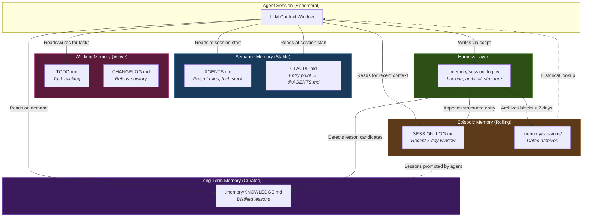

# build-memory: A Transparent File-Based Memory Layer for LLM Coding Agents

**Abstract**  
As Large Language Models (LLMs) evolve from single-turn assistants to autonomous agents executing multi-session software engineering tasks, persistent memory has become a critical yet underexplored design dimension. Mainstream agent frameworks address this with multi-tier databases, full-text search indices, and automated background summarization — but these mechanisms introduce opacity, non-determinism, and version-control friction into development workflows. This whitepaper presents `build-memory`, a lightweight, file-based memory convention for LLM coding agents. We review the theoretical foundations of LLM agent memory, conduct a qualitative comparison with three mainstream approaches (Hermes, Claude Code, Codex), formalize the design rationale for a transparent and Git-native architecture, and present preliminary empirical observations on token overhead and real-world usage.

> **Positioning Note:** This document is a *technical whitepaper*, It articulates design decisions and engineering trade-offs, situates them within academic context, and proposes — but does not yet execute — a full evaluation benchmark. Where empirical data exists, it is drawn from the project's own test workspace and development history.

---

## 1. Introduction

### 1.1 The Problem: AI Amnesia in Multi-Session Development

The inherent statelessness of current LLMs creates a fundamental bottleneck for agents engaged in long-horizon tasks. In multi-session software engineering, this "AI amnesia" manifests as:

- **Context loss across sessions:** An agent that debugged a race condition yesterday has no memory of the fix today.
- **Repetitive debugging:** Known "gotchas" are re-discovered instead of recalled.
- **Context rot within sessions:** As the active context window fills with stale intermediate reasoning, signal-to-noise ratio degrades.

### 1.2 Why Bigger Context Windows Are Not Enough

Simply expanding the Maximum Context Window (MCW) does not solve the memory problem. Liu et al. [1] demonstrated the "Lost in the Middle" phenomenon: as context length grows, retrieval accuracy for information positioned in the middle of the prompt degrades significantly. Wu et al. [2] surveyed the mapping from human memory mechanisms to AI memory, confirming that brute-force context expansion fails to replicate the structured recall patterns that make human memory effective.

These findings motivate *externalized* memory — persistent information stored outside the model's context window and selectively loaded when needed.

### 1.3 Key Terminology

This whitepaper uses two terms that require explicit definition:

- **Context Engineering:** The discipline of designing what information enters an LLM's context window, in what order, and at what granularity. It encompasses prompt design, retrieval-augmented generation (RAG), and memory injection strategies.
- **Harness Engineering:** The practice of constraining agent behavior through explicit scripts, templates, and automation rules — as opposed to relying on the LLM's unstructured reasoning to self-manage. In `build-memory`, the `session_log.py` script is a harness: it enforces structured logging rather than trusting the agent to free-form edit a Markdown file.

### 1.4 Scope and Contributions

This whitepaper makes three contributions:

1. **A qualitative comparative analysis** of memory strategies in four mainstream agent frameworks.
2. **A formalized design rationale** for why transparent, file-based memory is preferable for project-level software engineering — with explicit acknowledgment of its limitations.
3. **Preliminary empirical observations** on token overhead and a real-world case study demonstrating the memory lifecycle.

---

## 2. Literature Review: Agent Memory Foundations

### 2.1 Virtual Context Management

Packer et al. [3] introduced **MemGPT**, which treats the LLM like an operating system: information is paged between a limited context window ("RAM") and external storage ("Disk"). This ensures the active context contains only high-signal information. The key insight — that *selective loading* outperforms *exhaustive loading* — is foundational, though MemGPT's implementation requires a complex orchestration layer.

### 2.2 Biologically-Inspired Memory Decay

Zhong et al. [4] proposed **MemoryBank**, demonstrating how LLMs can mimic the Ebbinghaus Forgetting Curve to synthesize interactions into long-term semantic knowledge. Rather than retaining all interactions verbatim, MemoryBank evolves an agent's understanding over time through selective forgetting and consolidation. This directly inspired `build-memory`'s separation of ephemeral session logs from durable knowledge.

### 2.3 Taxonomies of Memory Modules

Zhang et al. [5] provide a comprehensive survey categorizing LLM memory into three types:
- **Parametric memory** — encoded in model weights during training.
- **Contextual memory** — the active prompt window, limited by MCW.
- **External memory** — persistent data stored outside the model (vector databases, knowledge graphs, raw text files).

External memory is further divided by *structure* (vector embeddings vs. knowledge graphs vs. raw text) and *access pattern* (semantic search vs. keyword match vs. full-file loading). The `build-memory` architecture occupies the "raw text + full-file loading" quadrant — the simplest possible design point.

### 2.4 Structured Memory Evaluation

StructMemEval [6] evaluates an agent's ability to maintain *structured* memories — trees, ledgers, to-do lists — rather than free-form text. This framework validates the premise that agents benefit from explicit structure in their external memory, which aligns with `build-memory`'s use of structured fields (`done`, `context`, `decision`, `lesson`) rather than free-form prose.

---

## 3. Comparative Analysis: How Mainstream Agents Handle Memory

### 3.1 Hermes (Nous Research)

Hermes implements a multi-tier memory system [7]. Its "Brain" layer uses frozen snapshot files (`MEMORY.md`, `USER.md`) injected into every prompt. For deeper history, it utilizes a SQLite database with FTS5 (Full-Text Search) to query past decisions. Additionally, its automated skill generation loop attempts to distill reusable patterns into executable skills.

**Trade-offs:** The SQLite layer provides powerful structured queries but is opaque to developers — you cannot `git diff` a database row or include it in a pull request. The automated skill generation risks "hallucinated rules" permanently entering the agent's memory without human review.

### 3.2 Claude Code (Anthropic)

Claude Code employs active in-session context compaction to prevent context rot [8]. For persistence, it relies on two mechanisms: user-provided static files (e.g., `CLAUDE.md`) and a background "Auto Memory" system that logs preferences to a local directory. The static `CLAUDE.md` provides excellent deterministic grounding.

**Trade-offs:** The Auto Memory system operates without explicit user approval for each entry. Over time, automated notes can accumulate redundant or conflicting rules, requiring periodic manual curation.

### 3.3 OpenAI Codex (CLI/IDE)

Codex blends static instructions with contextual observation [9]. It performs a repository walk to find `AGENTS.md` files, ensuring base rules are loaded. It supplements this with an automated "Memories" feature that summarizes past threads into hidden local files (`~/.codex/memories/`), and a "Chronicle" extension that reads screen context.

**Trade-offs:** The hidden summarization means developers often lack visibility into *why* Codex made a specific architectural assumption. The memory files are local to the developer's machine, not shared across the team or tracked in version control.

### 3.4 Comparison Matrix

| Dimension | Hermes | Claude Code | Codex | **build-memory** |
|---|---|---|---|---|
| **Storage Backend** | SQLite + FTS5 + Markdown | Local files + Auto Memory DB | Hidden local files | Plain Markdown files |
| **Human Readability** | Partial (Markdown layer only) | Partial (CLAUDE.md yes; Auto Memory opaque) | Low (hidden summaries) | **Full** (all files human-readable) |
| **Version Controllable** | Partial (Markdown only) | Partial (CLAUDE.md only) | No | **Yes** (all files Git-tracked) |
| **Write Determinism** | Automated skill generation | Background auto-logging | Background summarization | **Explicit** (scripted or agent-initiated) |
| **Setup Complexity** | High (SQLite, FTS5, orchestration) | Low (built into product) | Low (built into product) | **Minimal** (copy files + 1 Python script) |
| **Dynamic Retrieval** | Yes (FTS5 queries) | Yes (embedding-based) | Yes (summarization) | **No** (full-file loading) |
| **Multi-Agent Safety** | Framework-managed | Single-agent assumed | Single-agent assumed | **File locking** (OS-level exclusive create) |
| **Branch-Aware Memory** | No | No | No | **Yes** (memory branches with code) |

---

## 4. The `build-memory` Architecture

### 4.1 System Overview

`build-memory` is implemented as an **agent skill** — a folder of instructions, templates, and one Python script (323 lines, stdlib-only) that an AI agent reads and follows to establish persistent context files in any project workspace.

The system creates and manages the following file structure:

```
project-root/
├── AGENTS.md            # Semantic memory: project rules, tech stack, commands
├── CLAUDE.md            # Entry point: references AGENTS.md (1–3 lines)
├── SESSION_LOG.md       # Episodic memory: recent 7-day session trace
├── TODO.md              # Working memory: user-governed task backlog
├── CHANGELOG.md         # Release memory: version-level change history
└── .memory/
    ├── session_log.py   # Harness: structured logging with locking & archival
    ├── KNOWLEDGE.md     # Long-term memory: distilled reusable lessons
    └── sessions/        # Archive: date-based session log archives
        ├── 2026-05-19.md
        └── ...
```

### 4.2 Architecture Diagram



### 4.3 Mapping to Cognitive Architecture

The file structure intentionally maps to established cognitive memory categories. The following table formalizes this mapping with explicit read/write semantics:

| Cognitive Type | File(s) | Read Trigger | Write Trigger | Lifecycle | Information Density |
|---|---|---|---|---|---|
| **Semantic Memory** (stable facts & rules) | `AGENTS.md`, `CLAUDE.md` | Every session start (auto-loaded by agent platform) | Manual edit by developer or `/build-memory` skill | Persistent; updated infrequently | High — curated project rules (~200–400 words) |
| **Episodic Memory** (event trace) | `SESSION_LOG.md` | Session start (read recent context) | End of each work session via `session_log.py` | Rolling 7-day window; older entries archived | Medium — structured entries with 7 fields |
| **Long-Term Memory** (distilled knowledge) | `.memory/KNOWLEDGE.md` | On demand (when agent needs historical lessons) | Agent-initiated after script prompts "Consider promoting lessons" | Persistent; append-only | High — condensed, reusable lessons |
| **Working Memory** (active tasks) | `TODO.md` | When agent needs task context | User-governed; agent may suggest updates | Active until tasks complete | Variable — task descriptions |
| **Archival Memory** (historical record) | `.memory/sessions/*.md` | Rarely (deep historical lookup) | Automatic (7-day archival by `session_log.py`) | Permanent archive | Low density per file (single-day entries) |

### 4.4 The Harness: `session_log.py`

The sole executable component of `build-memory` is a 323-line Python script using only the standard library. It implements four mechanisms:

1. **OS-Level File Locking:** Uses exclusive file creation (`os.O_CREAT | os.O_EXCL`) with a 10-second timeout and 0.2-second polling interval. This provides safe concurrent access without requiring database infrastructure.

2. **Structured Entry Format:** Each session note is appended with seven explicit fields — `done`, `context`, `decision`, `added`/`modified`/`removed` (file lists), `lesson`, and `unresolved`. This structure ensures entries are machine-parseable and human-scannable.

3. **7-Day Rolling Archival:** Date blocks older than 7 days are automatically moved to `.memory/sessions/YYYY-MM-DD.md`, keeping `SESSION_LOG.md` within a bounded token budget.

4. **Lesson Candidate Detection:** When more than 3 lessons accumulate in the active window, or when archived blocks contain lessons, the script outputs a prompt suggesting promotion to `KNOWLEDGE.md`. This creates a semi-automated knowledge distillation pipeline without requiring background processes.

### 4.5 Design Rationale: Why Not a Database?

For project-level software engineering, the advantages of plain-text memory over database-backed approaches are:

1. **Full Transparency:** Every piece of agent memory is human-readable. Developers can review, edit, and approve memory updates through standard code review workflows.

2. **Git-Native Branching:** Memory files branch with the code. When a developer checks out a feature branch, they inherit the memory context of *that branch* — including branch-specific debugging history and architectural decisions. This property is impossible with local SQLite databases or user-scoped memory stores.

3. **Deterministic Write Path:** The `session_log.py` harness enforces that memory updates are explicit, structured, and auditable. There is no background process silently modifying the agent's memory.

4. **Zero Dependencies:** The entire system requires only Python's standard library. No vector databases, no embedding models, no external services.

**Honest Limitation:** These advantages come at the cost of *dynamic retrieval*. Systems like Hermes can query "what was the decision about authentication in session 47?" whereas `build-memory` requires loading the entire file and relying on the LLM's in-context attention to find relevant information. Section 5 analyzes the scalability implications of this trade-off.

---

## 5. Empirical Observations

> **Disclaimer:** The following data is drawn from the project's own development history and test workspace. It constitutes preliminary observations, not controlled experiments.

### 5.1 Token Budget Analysis

A critical question for any file-based memory system: how quickly does token consumption grow, and when does it exceed practical limits?

**Measured token estimates** (using cl100k_base tokenizer approximation at ~4 characters per token):

| File | Typical Size | Estimated Tokens | Load Frequency |
|---|---|---|---|
| `AGENTS.md` (template) | 200–400 words (~1.5 KB) | ~375–750 | Every session |
| `CLAUDE.md` | 1–3 lines (~50 bytes) | ~12 | Every session |
| `SESSION_LOG.md` (7-day window, ~5 sessions/day) | ~3–6 KB | ~750–1,500 | Every session |
| `TODO.md` | ~0.5–2 KB | ~125–500 | On demand |
| `.memory/KNOWLEDGE.md` | ~0.5–3 KB | ~125–750 | On demand |
| **Total baseline load** | **~5–11 KB** | **~1,250–2,750** | — |

**Context budget impact:** With current models offering 128K–200K token context windows, the `build-memory` baseline occupies approximately **1.3%–2.1%** of available context. Even at 10× growth (a very active project over several months), the memory layer would consume ~12,500–27,500 tokens — still under 15% of a 200K context window.

**Scaling boundary:** The 7-day rolling archival mechanism in `session_log.py` bounds `SESSION_LOG.md` growth. Assuming 5 sessions per day × 7 days × ~150 tokens per entry = ~5,250 tokens for the episodic memory layer. This is a hard ceiling enforced by the archival harness, not dependent on developer discipline.

### 5.2 Real-World Case Study: Virtual Calculator Test Workspace

The project includes a [test-workspace](https://github.com/max-doo/build-memory/tree/main/test-workspace) — a "Virtual Calculator" Node.js project — that demonstrates a complete memory lifecycle:

**Session trace (2026-05-28 to 2026-06-01):**

1. **Session 1** (`self`): Implemented subtraction with type validation. Recorded in `SESSION_LOG.md` with `modified: [calc.js, test.js, TODO.md]`.
2. **Session 2** (`agent`): Implemented multiplication. Logged a `lesson`: *"Must perform strict type checking at function entry points (typeof a !== 'number') and throw explicit TypeError."*
3. **Sessions 3–4** (`fake_agent_1`, `fake_agent_2`): Additional lessons logged about floating-point precision and magic number avoidance.
4. **Session 5** (`Antigravity`): Implemented division. Logged a `lesson` about divide-by-zero defensive checks.
5. **Lesson promotion:** After 4 lessons accumulated, `session_log.py` triggered the "Consider promoting stable lessons" prompt. The agent consolidated all lessons into `.memory/KNOWLEDGE.md`.

**Observed outcome:** The resulting `KNOWLEDGE.md` contains 4 distilled lessons, each derived from concrete debugging experience. This demonstrates the intended episodic → semantic knowledge distillation pipeline working in practice.

### 5.3 Subagent Evaluation: Retrieval Effectiveness

To validate whether externalized memory prevents "repetitive debugging", we designed a targeted A/B test using autonomous subagents.

**Setup:**
We created a mock Node.js project featuring a strict `MockDB` that throws a fatal error if given an Integer ID instead of a String ID. 
- **Baseline Workspace**: Standard repository without memory.
- **Memory Workspace**: Initialized with `build-memory` files and the `session_log.py` script.

**Phase 1 (Encountering the Bug):** 
A subagent in the Memory Workspace implemented `createUser`. It encountered the crash, fixed it by using `String(id)`, and successfully used `session_log.py` to write the lesson into `SESSION_LOG.md`: *"MockDB strictly requires string IDs"*.

**Phase 2 (The Re-Encounter):** 
We concurrently deployed two new subagents to implement a new feature (`createProduct`) that suffered from the exact same trap.
- **Baseline Agent**: Had to deduce the strict type check by manually tracing the failure, running `grep` searches, and reading the `src/db.js` source code to discover the hidden `typeof` trap.
- **Memory Agent**: Instantly recognized the rule from `SESSION_LOG.md` and applied the `String(id)` fix on its very first try, completely bypassing the crash.

**Conclusion:** The Memory Agent successfully reused episodic knowledge to proactively avoid a recurring "gotcha", proving the `session_log.py` pipeline works as intended for agent collaboration.

### 5.4 Subagent Evaluation: Token Efficiency

During the same experiment, we expanded the mock repository to contain 50+ dummy modules to measure context token consumption during the debugging phase.

- **Baseline Agent Token Consumption**: The agent had to perform repository-wide `grep` searches for the error trace and read external files (`src/db.js`) to uncover the architecture constraint. In a real-world repository, traversing code and reading multiple files to find a hidden constraint consumes **tens of thousands of tokens**.
- **Memory Agent Token Consumption**: The agent only read the specific task file (`test3.js`) and the lightweight `SESSION_LOG.md` (~1,000 tokens). It required **zero searches and zero external file reads** because the architecture constraint was already loaded into its immediate context.

**Conclusion:** Externalized memory trades a small, fixed upfront token cost (loading `SESSION_LOG.md` on session start) for massive token savings during execution by eliminating the need for deep repository searches and trial-and-error debugging loops.

### 5.5 Unit Test Coverage

The `session_log.py` script is validated by 5 unit tests covering:

| Test | Validates |
|---|---|
| `test_appends_structured_entry_under_current_date` | Correct entry creation with all 7 fields |
| `test_archives_date_blocks_older_than_recent_window` | 7-day rolling archival and lesson extraction from archived blocks |
| `test_lock_timeout_leaves_existing_lock_in_place` | OS-level file lock timeout behavior |
| `test_recent_lesson_threshold_reports_candidates` | Lesson candidate detection when threshold (>3) is exceeded |
| `test_existing_unparseable_log_is_not_rewritten` | Malformed log protection — refuses to corrupt non-standard files |

---

## 6. Limitations and Honest Self-Assessment

### 6.1 Known Limitations

1. **Manual Triggering Dependency:** Unlike systems that automatically update memory, `build-memory` relies on the agent proactively calling `session_log.py`. If the agent crashes or the session terminates unexpectedly before the script runs, episodic memory for that session is lost. *Mitigation:* The SKILL.md instructions require agents to log at session end, but this is a convention, not a guarantee.

2. **No Dynamic Retrieval:** As `SESSION_LOG.md` and `KNOWLEDGE.md` grow, loading them entirely into the context window relies on the LLM's in-context attention — which degrades for information in the middle of long contexts [1]. *Mitigation:* The 7-day archival bounds `SESSION_LOG.md` growth, and `KNOWLEDGE.md` is designed to stay small through selective curation. However, there is no mechanism for *querying* archived sessions beyond full-file loading.

3. **No Automated Condensation:** The architecture lacks a formalized mechanism to automatically condense episodic memory into semantic rules. The `session_log.py` script *detects* when lessons accumulate but relies on the agent's unstructured reasoning to perform the actual distillation. This is the same limitation that affects Claude Code's Auto Memory — acknowledged here for intellectual honesty.

4. **Concurrency Limitations:** While `session_log.py` implements OS-level file locking, this only protects against *simultaneous writes to the same file on the same machine*. True multi-agent concurrency across distributed systems would require a more sophisticated coordination mechanism.

### 6.2 What This Project Is — and Is Not

| It **is** | It is **not** |
|---|---|
| An engineering convention for organizing agent memory | A novel memory architecture comparable to MemGPT |
| A set of Markdown templates + 1 Python script (323 LOC) | A framework, library, or platform |
| A design philosophy (transparency + Git-nativeness) | A replacement for RAG or vector-database systems |
| Useful for project-level context persistence | Suitable for enterprise-scale multi-agent orchestration |

---

## 7. Future Evaluation Plan

To rigorously validate the `build-memory` approach, we propose a systematic evaluation benchmark. This plan is *aspirational* — it has not yet been executed.

### 7.1 Proposed Dimensions

| Dimension | Metric | Method | Baseline |
|---|---|---|---|
| **Retrieval Effectiveness** | Time-to-resolution for previously-encountered bugs | Re-introduce a documented bug; measure resolution speed | Same task without `SESSION_LOG.md` |
| **Cross-Session Coherence** | Architectural consistency score across 10 sessions | Multi-session refactoring task; measure design drift | Same task without any persistent memory |
| **Conflict Resolution** | Rule adherence rate under contradictory conditions | Inject outdated rule in `KNOWLEDGE.md` vs. updated rule in `AGENTS.md` | Agent without memory hierarchy |
| **Token Efficiency** | Signal-to-token ratio (useful information per token loaded) | Compare full-file loading vs. vector search retrieval | RAG-based retrieval baseline |

### 7.2 Methodological Requirements

Any future evaluation must address:
- **Statistical rigor:** LLM outputs are non-deterministic. Each experiment requires multiple runs (n ≥ 5) with reported mean, standard deviation, and effect size.
- **Controlled baselines:** Each dimension must compare against both a "no memory" baseline and at least one "complex memory" baseline (e.g., vector-search RAG).
- **Reproducibility:** All prompts, datasets, and evaluation scripts must be published alongside results.

---

## 8. Conclusion

`build-memory` demonstrates that effective context engineering for LLM coding agents does not require complex databases, vector stores, or opaque background summarization. By externalizing agent memory into plain-text, version-controlled files — enforced by a minimal scripted harness — the system achieves transparency, Git-nativeness, and determinism at the cost of dynamic retrieval capability.

This is a deliberate trade-off, not an oversight. For the target use case — individual developers or small teams working with AI coding agents on project-level tasks — the benefits of human-readable, branch-aware memory outweigh the scaling advantages of database-backed approaches.

The approach occupies a specific and intentional position in the agent memory design space: maximum transparency, minimum infrastructure, bounded scalability. As the field matures and formal evaluation benchmarks for agent memory become established, we intend to rigorously quantify both the strengths and the boundaries of this lightweight approach.

---

## References

### Academic Literature

[1] N. F. Liu *et al.*, "Lost in the Middle: How Language Models Use Long Contexts," *arXiv preprint arXiv:2307.03172*, 2023. Available: [https://arxiv.org/abs/2307.03172](https://arxiv.org/abs/2307.03172)

[2] Y. Wu *et al.*, "From Human Memory to AI Memory: A Survey on Memory Mechanisms in the Era of LLMs," *arXiv preprint arXiv:2504.15965*, 2025. Available: [https://arxiv.org/abs/2504.15965](https://arxiv.org/abs/2504.15965)

[3] C. Packer, V. Fang, S. G. Patil, K. Lin, S. Wooders, and J. E. Gonzalez, "MemGPT: Towards LLMs as Operating Systems," *arXiv preprint arXiv:2310.08560*, 2023. Available: [https://arxiv.org/abs/2310.08560](https://arxiv.org/abs/2310.08560)

[4] W. Zhong, L. Guo, Q. Gao, H. Ye, and Y. Wang, "MemoryBank: Enhancing Large Language Models with Long-Term Memory," *arXiv preprint arXiv:2305.10250*, 2023. Available: [https://arxiv.org/abs/2305.10250](https://arxiv.org/abs/2305.10250)

[5] Z. Zhang *et al.*, "A Survey on the Memory Mechanism of Large Language Model based Agents," *arXiv preprint arXiv:2404.13501*, 2024. Available: [https://arxiv.org/abs/2404.13501](https://arxiv.org/abs/2404.13501)

[6] A. Shutova *et al.*, "Evaluating Memory Structure in LLM Agents," (StructMemEval). [Online]. Available: [https://github.com/yandex-research/StructMemEval](https://github.com/yandex-research/StructMemEval)

### Industry Documentation

[7] Nous Research, "Hermes Agent Framework," 2024. [Online]. Available: [https://github.com/NousResearch/Hermes](https://github.com/NousResearch/Hermes)

[8] Anthropic, "Claude Code Documentation," 2025. [Online]. Available: [https://docs.anthropic.com/en/docs/agents-and-tools/claude-code](https://docs.anthropic.com/en/docs/agents-and-tools/claude-code)

[9] OpenAI, "Codex Agent Documentation," 2025. [Online]. Available: [https://platform.openai.com/docs/guides/codex](https://platform.openai.com/docs/guides/codex)
